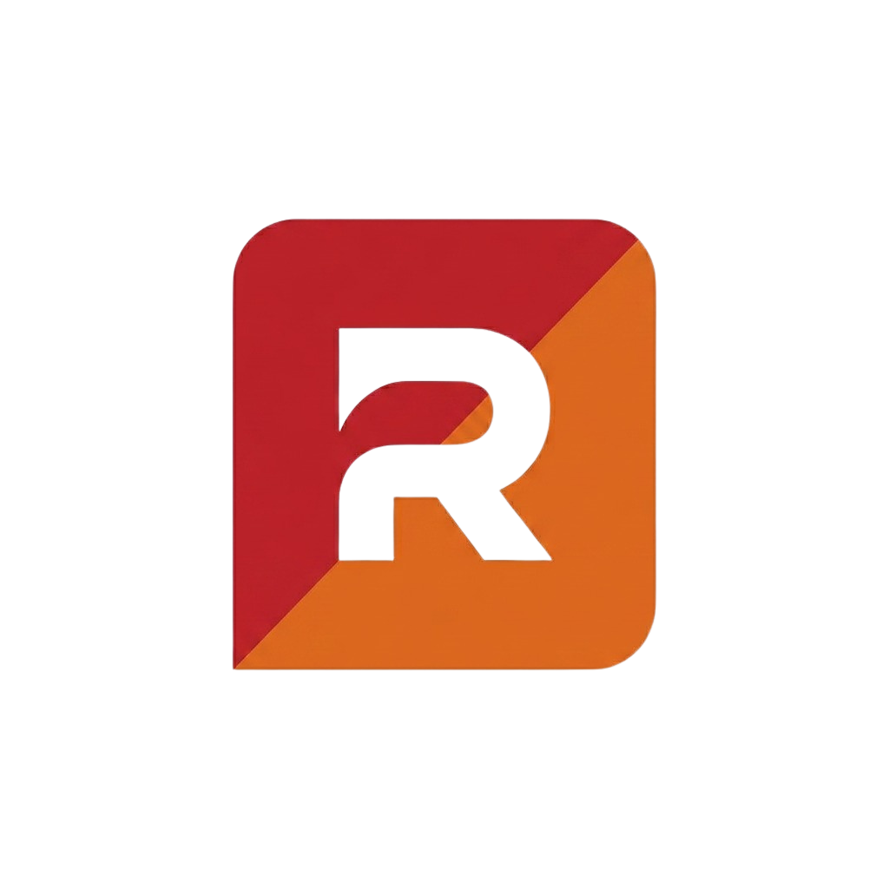

<div align="center">
  
  <h1> Rendertry</h1>
  <p><strong>Visualizador Inmersivo de Personalización Automotriz</strong></p>

  
  
  

</div>

<br />

> **Rendertry** es una plataforma web modernizada que ofrece una experiencia inmersiva para previsualizar modificaciones vehiculares. Prueba rines, pintura, vinilos y accesorios directamente sobre la foto de tu auto en segundos.

---

##  Características Principales

-  **Visuales Inmersivos:** Banner principal de alto impacto con un escenario interactivo de visualización de vehículos.
-  **UI/UX Moderno:** Estética profesional en "Dark Mode" con vibrantes acentos "Racing Red".
-  **Arquitectura CSS Modular:** Estructura basada en componentes para un mantenimiento altamente eficiente.
-  **Totalmente Responsivo:** Diseño fluido optimizado para escritorio, laptops, tablets y dispositivos móviles.
-  **Interacciones Dinámicas:** Animaciones fluidas, menú de rines flotante e interactivo, y sliders dinámicos comparativos (Antes y Después).

---

##  Estructura del Proyecto

```text
Rendertry/
├── src/
│   ├── assets/         # Imágenes, iconos y modelos (Rines, Autos)
│   ├── css/            # Estilos del proyecto
│   │   ├── components/ # Módulos CSS (nav, hero, botones, etc.)
│   │   ├── base.css    # Variables y resets globales
│   │   └── main.css    # Archivo centralizador de estilos
│   ├── js/             # Lógica interactiva en JavaScript
│   ├── partials/       # Componentes HTML reutilizables (Header, Footer)
│   ├── index.html      # Landing page y visor principal
│   ├── contacto.html   # Página de contacto
│   └── nosotros.html   # Página sobre nosotros
└── README.md
```

---

##  Empezando

Para previsualizar el proyecto localmente, no requieres de una configuración compleja o de compiladores pesados. Puedes utilizar cualquier servidor local básico.

### Usando Node.js (npx)
```bash
npx serve src
```

### Usando Python
```bash
python -m http.server 8080 -d src
```

> **Nota:** Una vez iniciado, abre `http://localhost:8080` (o el puerto que te indique tu consola) en tu navegador preferido.

---

##  Tecnologías Utilizadas

- **Marcado:** HTML5 Semántico
- **Estilos:** Vanilla CSS3 (Custom Properties, Flexbox, CSS Grid)
- **Interactividad:** Vanilla JavaScript
- **Iconografía:** [Lucide Icons](https://lucide.dev/)

---

<div align="center">
  <br>
  <p>Construido con pasión para entusiastas del motor.</p>
  <p>&copy; Rendertry. Todos los derechos reservados.</p>
</div>
